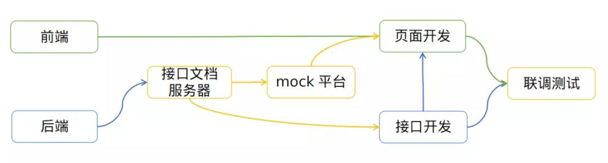

# 前后端分离


## 前后端

- 前端
  - 接收数据，返回数据
  - 处理渲染逻辑
  - 代码跑在浏览器上
- 后端
  - 提供数据
  - 处理业务逻辑
  - 代码泡在服务器上


## 开发流程

- 后端编写 + 更新接口文档
- 后端根据接口文档进行 接口开发
- 前端根据接口文档进行 开发 + Mock平台





Mock 平台：

- Swagger：https://swagger.io/
- YApi：http://yapi.demo.qunar.com/


## 接口规范

请求的格式

- GET
- POST


响应的格式

- ```json
  {
      code: 200,
      data: {
          message: "success",
          
          // 响应实体
          entity: {
              id: 1,
              name: "XXX",
          },
          
          // 响应列表
          list: [
              {
                  id: 1,
                  name: "XXX"
              },
              {
                  id: 2,
                  name: "XXX"
              }
          ],
          
          // 响应分页
          recordCount: 2 // 当前页记录数
          pageNo: 1,  // 当前页码
          list: [
          	{
                  id: 1,
                  name: "XXX"
              },
              {
                  id: 2,
                  name: "XXX"
              }
          ],
          totalCount: 2,  // 总记录数
          totalPage: 1,  // 总页数
          pageSize: 10,  // 每页大小
      }
  }
  ```

- code

  ```json
  200: 请求处理成功
  500: 请求处理失败
  401: 请求未认证，跳转登录页
  406: 请求未授权，跳转未授权提示页
  ```

- data.message

  ```json
  code=200 && data.message="success": 请求处理成功
  
  code=200 && data.message!="success": 请求处理成功, 普通消息提示：message的内容
  
  code=500: 请求处理失败，警告消息提示：message的内容
  ```


